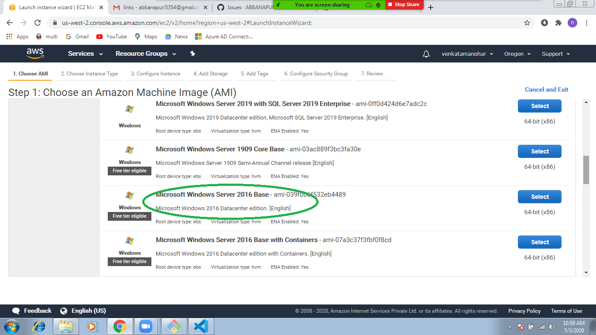

# Sync On-premisis users to azure active directory
## Lab Setup:
  ### setup On-Premisis:
    1. deploy Windows server 2016

    2. login EC2 machine\
    3. install active directory\
[install Windows AD Click Here](http://pc-addicts.com/setup-active-directory-server-2016/)\
    4. create users in Windows AD\
[create user in Windows AD](https://activedirectorypro.com/how-to-create-a-new-active-directory-user-account/)
     
 ### Azure Cloud AD Setup:
    1. create tenant 
    2. create user 
      * assign Global admin role 
      * login into  azure portal and reset password # 

## sync between On-premisis to Azure AD using Azure AD Connect
   * install azure ad connect on On-premisis
   * in this connectvity process we need On-Premisis and azure ad users details (user Name and Passwords)
 

## Testing:
  * create user in Windows AD
  * Please run schema update configure on Azure ad connect
  * Please check in Azure AD 

