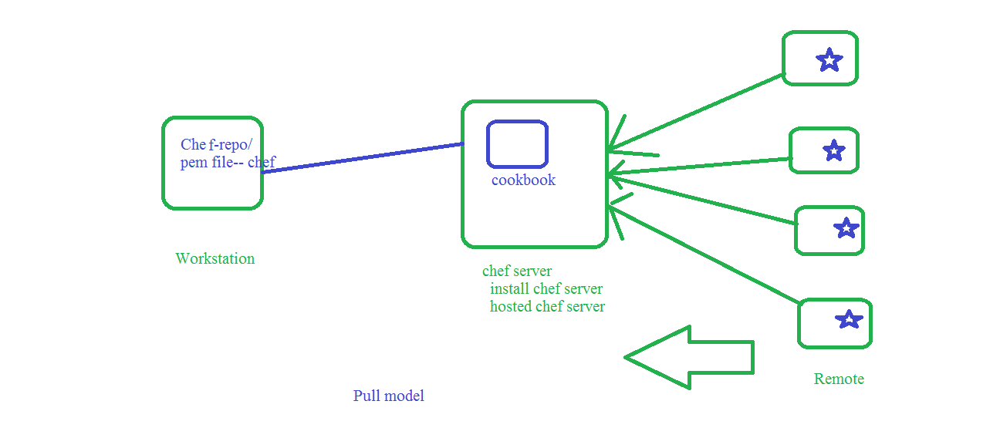

## Chef:
 1. pull based CM tool (agent based CM tool)
 2. chef-clinet is agent we need to install on all remote nodes = Bootstraping 

## chef Lab Setup:
 1. Workstation: its support all platforms (windows , linux , MAC) 
    1. launch ec2 machine(ubuntu) and login into EC2 machine
    2. install chefDk 
[chef workstation setup](https://docs.chef.io/workstation/install_workstation/)
    ```
    wget https://packages.chef.io/files/stable/chefworkstation/0.14/ubuntu/18.04/chefworkstation_0.14.16-1_amd64.deb
    dpkg -i chefworkstation_0.14.16-1_amd64.deb
    ```
 2. Chef server: it support only linux/unix platform
    * we have two options 
       1. install chef on any linux platform
    [chef server installation Docs](https://www.linode.com/docs/applications/configuration-management/install-a-chef-server-workstation-on-ubuntu-18-04/)
       2. Hosted chef server 
    [signup](https://manage.chef.io/signup)
    [login](https://manage.chef.io/login)
       3.  create orgnization in hosted chef server
       4.  download starter kit     
 3. Remote nodes: it could be any OS
     * remote nodes nothing but where we apply cookbook
     * if you want add remote nodes we need to do bootstrap 
    [bootstarp](https://docs.chef.io/install_bootstrap/)
     * bootstrap command run from  workstation 
    ```
    knife bootstarp 172.31.15.45 -U ubuntu -i /home/ubuntu/chef.pem --sudo -N ip-172-31-15-45.us-west-2.compute.internal
    ```
   