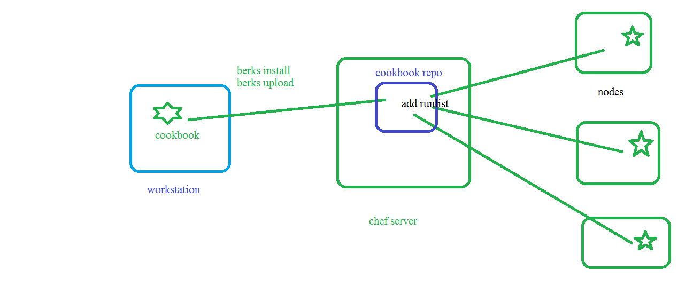

## COOKBOOK:
* goto cd ~/chef-repo/cookbboks
    ```
    chef generate cookbook apache2 -b 
    ```
### install apache2 in ubuntu manually
```
sudo apt-get update
sudo apt-get install apache2 -y
```
## write cookbook for apache2
* these steps we need to do from chef workstation (inside chef-repo/cookbook/cookbookname) directory
1. wrire cookbook
    ```
    apt_update 'update' do
        action :update
    end
    apt_package 'apache2' do
        action :install
    end
    ```
 2. execute berks install veryfirst time
    ```
     berks install
    ```
 3. upload cookbook to chef server 
    ```
    berks upload
    ```
 4. if you change anythingincookbook we need to change version in metadata.rb

